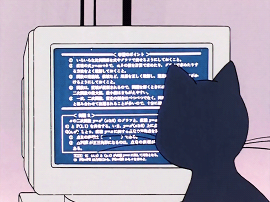

  

#

Prazer, me chamo Dyeiwison Ferreira da Silva, tenho 20 anos. Atualmente estou cursando Bacharelado em Ciências da Computação na Universidade Vale do Aracaú (UVA). 
 
#

<h3 align="left">Minha Estande ~</h3>

 
 

<h3 align="left">GitHub Stats</h3>

  

<picture align="center">
  <source media="(prefers-color-scheme: dark)" srcset="https://raw.githubusercontent.com/paulopontodev/paulopontodev/output/github-contribution-grid-snake-dark.svg">
  <source media="(prefers-color-scheme: light)" srcset="https://raw.githubusercontent.com/paulopontodev/paulopontodev/output/github-contribution-grid-snake-dark.svg">
  
</picture>